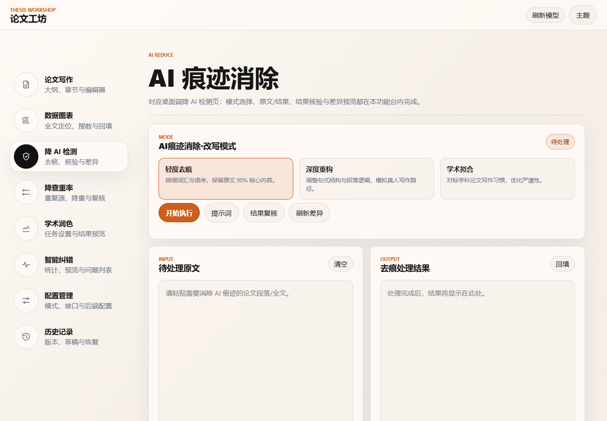
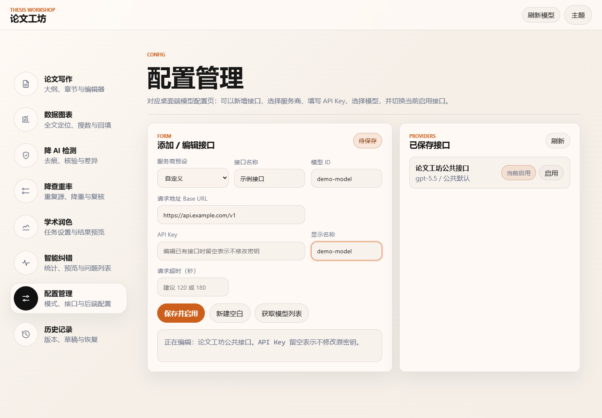

# 论文工坊

论文工坊是一款本地运行的 AI 论文工作台。当前项目同时保留桌面端入口和本地 Web 工作台，核心功能围绕论文写作、数据图表、降 AI 检测、降查重率、学术润色、智能纠错、模型配置和历史草稿管理展开。

项目默认把界面和数据放在本地，AI 功能通过你配置的模型接口调用外部服务。适合在 Windows 上直接运行，也提供跨平台打包脚本用于生成 Windows、macOS 和 Linux 发布包。

## 界面预览

<div align="center">
  <table>
    <tr>
      <td align="center" width="50%">
        <br>
        <strong>论文写作</strong>
      </td>
      <td align="center" width="50%">
        <br>
        <strong>数据图表</strong>
      </td>
    </tr>
    <tr>
      <td align="center" width="50%">
        <br>
        <strong>降 AI 检测</strong>
      </td>
      <td align="center" width="50%">
        <br>
        <strong>配置管理</strong>
      </td>
    </tr>
  </table>
</div>

## 当前功能

### 论文写作

- 根据论文题目、学科方向、论文类型、引用格式和目标字数生成大纲。
- 支持上传论文模板并解析目录结构，模板格式包括 DOC、DOCX、PDF、TXT 和 Markdown。
- 可按章节撰写正文，也可批量撰写全部章节。
- 支持生成摘要、整理参考文献，并在章节写作后维护参考文献编号。
- 内置章节导航、章节搜索、富文本编辑器、查找替换、复制和草稿自动保存。
- 支持将全文、章节或小节推送到数据图表、降 AI、降重、润色和纠错功能区继续处理。
- 支持导出 Word、Markdown 和 TXT。Word 导出会尽量保留标题、段落、表格、图片和公式。

### 数据图表

- AI 阅读全文，定位适合插入数据图或数据表的位置。
- 根据论文内容生成检索方向，也可手动补充数据范围、单位、标题和来源。
- 支持生成柱状图、折线图、结构图和论文表格。
- 支持上传辅助数据文件或手动粘贴数据表。
- 生成后可回填到论文对应位置，并同步补充参考文献。
- 图表图片会保存到本地 Web 静态目录，便于导出时引用。

### 降 AI 检测

- 提供轻度改写、深度改写和学术风格三种处理模式。
- 尽量保留事实、数据、公式、术语和引用编号。
- 支持自定义提示词模板。
- 处理后提供差异预览，方便确认修改幅度。

### 降查重率

- 提供轻度、中度和深度降重模式。
- 可粘贴查重报告或重复源文本，让改写更贴近重复位置。
- 输出结果可继续编辑、刷新差异并回填到论文工作区。

### 学术润色

- 支持章节正文、论文大纲、摘要、引言、结论和自定义段落等任务类型。
- 支持标准模式、学术强化、结构重组和精炼压缩等执行方式。
- 提供词汇优化、逻辑优化和全面润色三类润色方向。
- 可添加补充说明，并支持翻译润色入口。

### 智能纠错

- 检查基础文字、语法句法、学术格式、引用规范、数据表达、逻辑严谨性、合规风险和 AI 写作痕迹等问题。
- 按问题类别统计并展示问题列表。
- 支持引用规范检查和 AI 风格扫描。
- 可查看修正预览、差异对比和问题详情，部分问题支持自动修复。

### 配置与历史

- 在 Web 工作台中新增、保存、启用和切换模型接口。
- 支持 OpenAI Chat Completions 兼容接口、Anthropic Messages、Google Generative AI，以及 OpenRouter 等预设。
- 可获取远端模型列表，也可手动填写模型 ID。
- Web 端按浏览器用户保存独立配置和草稿。
- 自动保存当前草稿，并记录生成、降重、润色、纠错等操作历史，支持预览和恢复。

## 快速开始

### 1. 安装依赖

建议使用 Python 3.11 及以上版本。

```powershell
python -m venv .venv
.\.venv\Scripts\python.exe -m pip install --upgrade pip
.\.venv\Scripts\python.exe -m pip install -r requirements.txt
```

### 2. 启动 Web 工作台

Windows 下可直接双击或运行：

```powershell
.\run.bat
```

也可以手动启动：

```powershell
.\.venv\Scripts\python.exe web_server.py
```

默认地址是：

```text
http://127.0.0.1:8765/
```

常用参数：

```powershell
.\.venv\Scripts\python.exe web_server.py --host 127.0.0.1 --port 8765 --no-open
```

### 3. 启动桌面端

项目仍保留桌面端入口：

```powershell
.\.venv\Scripts\python.exe main.py
```

桌面端主要由 `modules/app_shell.py` 提供界面逻辑，Web 工作台由 `web_server.py`、`web/index.html`、`web/app.js` 和 `web/styles.css` 提供。

## 模型接口配置

打开 Web 工作台后进入“配置管理”页面：

1. 选择服务商预设或自定义接口。
2. 填写接口名称、Base URL、模型 ID 和 API Key。
3. 点击“保存并启用”。
4. 如接口支持模型列表，可点击“获取模型列表”。

常见配置示例：

| 类型 | Base URL 示例 | 说明 |
| --- | --- | --- |
| OpenAI | `https://api.openai.com/v1` | 使用 OpenAI Chat Completions 格式 |
| OpenRouter | `https://openrouter.ai/api/v1` | OpenAI 兼容格式 |
| 自定义兼容接口 | 按服务商文档填写 | 适合本地代理或第三方转发 |
| Anthropic | 按 Anthropic Messages API 填写 | 使用 `x-api-key` 认证 |
| Gemini | 按 Google Generative AI API 填写 | 使用 Google API Key |

没有配置可用接口时，编辑、草稿、导入导出等本地功能仍可使用，但生成和改写类 AI 功能无法执行。

## 文件与数据

- `config.enc`：本地模型接口配置文件。
- `history.json`：桌面端历史记录。
- `usage_events.jsonl`：模型调用用量记录。
- `web/generated/charts/`：Web 端生成的数据图表图片。
- `server_errors.log`：Web 服务端异常日志。
- 浏览器草稿和 Web 历史记录保存在浏览器本地存储中。

如果需要解析旧版 `.doc` 模板，可安装 LibreOffice。项目提供了辅助脚本：

```powershell
.\installers\install_libreoffice_windows.ps1
```

## 导出能力

论文工作区支持导出：

- `.docx`
- `.md`
- `.txt`

导出 Word 时，如果系统安装了 Pandoc，会优先使用 Pandoc 处理 Markdown、公式、表格和图片；未安装 Pandoc 时会回退到 `python-docx` 实现。

## 打包发布

项目使用 PyInstaller 打包，并提供跨平台构建脚本：

```powershell
.\.venv\Scripts\python.exe build.py --clean
```

生成安装包：

```powershell
.\.venv\Scripts\python.exe build.py --clean --installer
```

构建产物输出到 `dist/`。

当前构建脚本支持：

- Windows：生成 `.exe`，可选生成 Inno Setup 安装程序。
- macOS：生成 `.dmg`。
- Linux：生成 AppImage、DEB 和 RPM。

GitHub Actions 会在推送 `v*` 标签或手动触发时执行跨平台构建。

## 项目结构

```text
.
├── main.py                  # 桌面端启动入口
├── web_server.py            # 本地 Web 工作台后端
├── web/                     # Web 前端静态文件
├── modules/                 # 核心功能模块
├── pages/                   # 配置页辅助逻辑
├── installers/              # 安装与打包辅助脚本
├── Introduction/            # 历史预览图与说明素材
├── output/playwright/       # README 预览图与界面检查截图
├── build.py                 # 跨平台构建脚本
├── requirements.txt         # Python 依赖
└── run.bat                  # Windows Web 工作台启动脚本
```

## 注意事项

- AI 生成功能依赖网络和有效的模型接口配置。
- 使用外部模型接口时，请自行确认论文、数据和 API Key 的合规性与隐私要求。
- AI 输出需要人工复核，尤其是参考文献、数据来源、公式、引文编号和事实性表述。
- Web 服务默认只监听 `127.0.0.1`，适合本机使用。如需局域网访问，请自行评估安全风险后再修改 `--host`。

## 本地隐私与上传说明

默认情况下，`config.enc`、`config_dir.json`、`history.json`、`usage_events.jsonl`、`server*.log` 和 `web/generated/` 已加入 `.gitignore`，不会作为新文件随代码提交上传。它们可能包含模型接口配置、API Key、调用记录、错误日志、论文草稿或生成图表，请不要手动强制提交。

项目代码不应硬编码个人 API Key、内网地址、论文原文、查重报告或其他私有数据。公开截图、录屏或 README 预览图前，请确认其中没有真实接口地址、密钥、姓名、学校、论文题目、未公开数据和浏览器本地草稿。

调用外部模型接口时，当前任务输入的论文内容、提示词、数据表或相关上下文会发送给你配置的服务商；本项目本身不主动上传本地历史记录和配置文件。请根据服务商隐私政策、学校或单位要求决定是否使用在线模型。

## 免责声明

本项目仅用于项目研究与技术学习。使用本软件产生的任何学术、法律或其他后果，均由使用者及相关作者本人自行承担，项目维护者不对 AI 生成内容的真实性、合规性、原创性或最终使用结果作任何保证。

## 致谢

本项目参考并基于 [Abnerla/AI_Paper](https://github.com/Abnerla/AI_Paper) 的相关思路与工程基础进行开发，在此表示感谢。

## 支持作者

如果论文工坊对你的学术写作有所帮助，可以支持一下作者。

<div align="center">
  
</div>

## 许可证

本项目使用 Apache License 2.0，详见 [LICENSE](LICENSE)。
